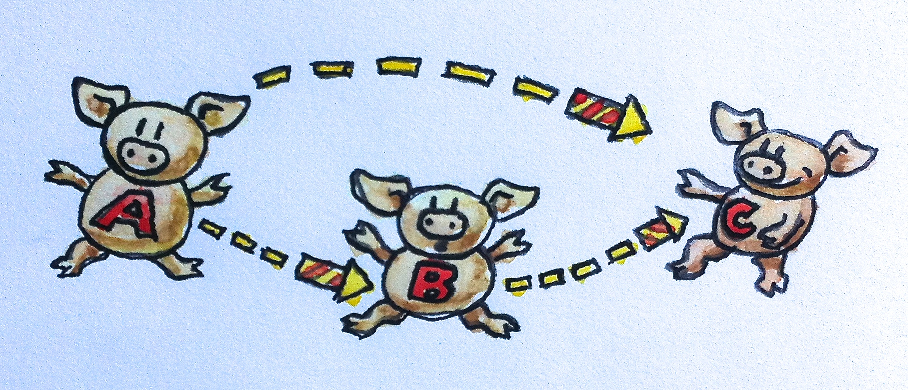

범주는 대상(object)과 그 대상들 사이를 연결하는 화살표로 구성되는, 매우 간단한 개념이다. 이것이 범주를 그림으로 표현하기 쉬운 이유이다. 대상은 원이나 점으로 그릴 수 있고, 화살표는… 화살표이다. (다양성을 위해, 가끔 대상를 돼지로 그리고 화살표를 불꽃놀이로 그릴 것이다.) 하지만 범주의 본질은 합성이다. 혹은, 합성의 본질은 범주이다. 화살표는 합성될 수 있으므로, 대상 A에서 대상 B로 가는 화살표가 있고, 대상 B에서 대상 C로 가는 또 다른 화살표가 있다면, A에서 C로 가는 화살표(그들의 합성)가 반드시 존재해야 한다.

# 함수로써의 화살표
이 설명이 너무 추상적인가? 낙심하지 마라. 구체적인 것에 대해 이야기해 보자.

화살표들을 함수로 생각해보자. 이것들은 사상(morphism)이라고도 부른다.


A 타입의 인자를 받아 B를 반환하는 함수 f가 있다. B를 받아 C를 반환하는 또 다른 함수 g가 있다. f의 결과를 g에 전달함으로써 그들을 합성할 수 있다. 그럼으로써 당신은 방금 A를 받아 C를 반환하는 새로운 함수를 정의했다. 

수학에서, 이러한 합성은 함수 사이에 작은 원으로 표시된다: \\( g \circ f \\)

합성의 순서가 오른쪽에서 왼쪽임에 주목하라. 이것은 어떤 사람들에게는 혼란스러울 수 있다.

Unix의 파이프 표기법에 익숙하다면,
```bash 
lsof | grep Chrome
```
이 경우 왼쪽에서 오른쪽으로 진행된다. 
하지만 수학과 Haskell에서는 함수들이 오른쪽에서 왼쪽으로 합성된다. g◦f를 "g 이후 f"로 읽는다면 도움이 된다.

## Rust에서의 합성

명확히 하기 위해 실제 코드에서의 예를 들어보자.  
 \
A 타입의 인수를 받고 B 타입의 값을 반환하는 함수 f
```rust
fn f(a: A) -> B { /*...*/ }
```
B 타입의 인수를 받고 C 타입의 값을 반환하는 함수 g
```rust
fn g(a: B) -> C { /*...*/ }
```
두 함수의 합성은 다음과 같다.
```rust
fn g_after_f(a: A) -> C {
    f(g(a))
}
```
 \
클로저를 사용해서 표현할 수도 있다.
```rust
let f = |a: A| -> B { /*...*/ };

let g = |b: B| -> C { /*...*/ };

let g_after_x = |a: A| -> C { f(g(x)) };
```
안타깝게도, 러스트에 두 함수를 받아 그들의 합성을 반환하는 연산자나 키워드는 없다.

## Haskell에서의 합성

하스켈에서 A에서 B로의 함수는 다음과 같이 선언한다.
```haskell
f :: A -> B
```
g도 마찬가지
```haskell
g :: B -> C
```
그들의 합성은 다음과 같다.
```haskell
g . f
```
매우 간단하다. 심지어 하스켈은 유니코드 문자도 지원하기 때문에 다음과 같이 쓸 수도 있다.
```haskell
g ◦ f
```

또한 함수도 유니코드 이중 쌍점과 화살표르 이용해 선언할 수 있다.
```haskell
f ∷ A → B
```
하스켈에서 이중 쌍점은 "이런 타입을 가진다"라는 뜻이다.   
함수 타입은 두 타입 사이에 화살표를 넣어 만들어진다.   
또한 두 함수의 합성은 사이에 점이나 유니코드 원을 끼워넣으면 된다.

# 합성의 속성
모든 범주에서의 합성은 반드시 만족해야 하는 두가지 매우 중요한 속성이 있다.

## 결합 법칙
세 개의 사상 f, g, h가 있고(그들의 객체가 끝에서 끝으로 일치하여) 합성될 수 있다면, 그들을 합성하기 위해 괄호가 필요하지 않다. 

수학 표기법으로는   
 \
\\( h \circ (g \circ f) = (h \circ g) \circ f = h \circ g \circ f
 \\)

이 식에서 \\( \circ \\) 기호는 사상의 합성을 나타낸다. 이는 프로그래밍의 함수 합성에도 직접적으로 적용된다.

(유사)하스켈에서는
```haskell
f :: A -> B
g :: B -> C
h :: C -> D
h . (g . f) == (h . g) . f == h . g . f
```
함수에 대한 동등성이 실제론 정의되지 않았기 때문에 유사라고 했다.

## 항등 법칙
모든 대상 A에 대해 합성의 단위가 되는 화살표가 있다. 이 화살표는 대상에서 자신에게로 돌아오는 루프를 형성한다. 합성의 단위가 되는 것은, A에서 시작하거나 A에서 끝나는 어떤 화살표와 합성될 때, 각각 동일한 화살표를 돌려주는 것을 의미한다. 대상 A에 대한 단위 화살표는 idA(대상 A에 대한 항등)라고 불린다.

수학 표기법에서, 만약 f가 A에서 B로 간다면

\\( f \circ id_A = f \\)

그리고 반대 방향에 대해서는

\\( id_B \circ f = f \\)

함수를 다룰때는, 항등 화살표는 그저 인자를 그대로 돌려주는 함수로 구현된다. 이 구현은 모든 타입에 대해 동일하며, 이는 이 함수가 보편적으로 다형성을 가진다는 것을 의미한다.

Rust에서는 제네릭으로 정의할 수 있다.
```rust
fn id<T>(x: T) -> T { x }
```
실제로 사용할때는 소유권 규칙을 조심해야 한다. 값을 함수 인자로 넘겨주면 소유권이 넘어가고 그 값을 소유했던 변수는 미할당 상태가 된다는 것을 유의하라

하스켈에서는 항등 함수가 표준 라이브러리의 일부이다. 여기 그 선언과 정의가 있다.
```haskell
id :: a -> a
id x = x
```
보다시피 하스켈에서의 다형성 함수는 아주 간단하다. 선언에서 단지 타입을 타입 변수로 바꾸면 된다. 여기에 요령이 있다; 구체적인 타입의 이름은 항상 대문자로 시작하고, 타입 변수의 이름은 소문자로 시작한다. 그래서 여기에서 a는 모든 타입을 대표한다.

Haskell 함수 정의는 함수 이름 뒤에 형식 매개변수가 오며, 여기서는 하나인 x만 있으며, 함수의 본문은 등호 다음에 온다. 이러한 간결함은 새로운 사용자들에게 종종 충격을 주지만, 이것이 완벽한 의미를 가진다는 것을 곧 알게 될 것이다. 함수 정의와 함수 호출은 함수형 프로그래밍의 기본이므로, 그 문법은 최소한으로 줄어든다.

나중에 여러 매개변수를 가진 함수를 정의할때는, 매개변수 리스트 주변에 괄호가 없을 뿐만 아니라, 매개변수 사이에 쉼표도 없다는 것도 보여줄것이다.

또한 함수의 본문은 항상 표현식이다 — 함수 안에는 문장이 없다. 함수의 결과는 이 표현식이다 — 여기서는 단지 x이다.

항등 조건은 (다시, 유사-Haskell로) 다음과 같이 쓸 수 있다.
```haskell
f . id == f
id . f == f
```

당신은 스스로에게 물어볼 수 있다: 왜 누군가는 아무것도 하지 않는 항등 함수에 신경을 쓰는가? 다시 말해, 우리는 왜 숫자 0에 신경을 쓰는가? 0은 아무것도 없음을 상징하는 기호이다. 고대 로마인들은 0이 없는 숫자 체계를 가지고 있었고, 그들은 오늘날까지도 살아남은 훌륭한 도로와 수도교를 건설할 수 있다.

0이나 id와 같은 중립 값들은 기호 변수들을 다룰 때 매우 유용하다. 그래서 로마인들은 대수학에서 그다지 뛰어나지 않았지만, 0이라는 개념을 잘 알고 있던 아랍인들과 페르시아인들은 그렇지 않았다. 따라서 항등 함수는 고차 함수의 인자로, 혹은 고차 함수로부터의 반환값으로 매우 유용하게 사용된다. 고차 함수는 함수의 기호적 조작을 가능하게 하는 것이다. 그것들은 함수의 대수이다.

__요약: 범주는 대상들과 화살표들(사상들)로 구성되어 있다. 화살표들은 합성될 수 있으며, 그 합성은 결합 법칙을 만족한다. 모든 대상은 합성 속에서 단위 역할을 하는 항등 화살표를 가지고 있다.__

# 합성은 프로그래밍의 본질
함수형 프로그래머들은 문제를 접근하는 데 있어 독특한 방식을 가지고 있다. 그들은 매우 올바른 질문을 던지기 시작한다. 예를 들어, 상호작용적인 프로그램을 설계할 때, 그들은 "상호작용이란 무엇인가?"라고 묻는다. 콘웨이의 'Game of Life'을 구현할 때, 그들은 아마도 생명의 의미에 대해 깊이 고민할 것이다. 이 정신으로, 나는 "프로그래밍이란 무엇인가?"라고 묻고자 한다. 가장 기본적인 수준에서, 프로그래밍은 컴퓨터에게 무엇을 하라고 지시하는 것에 대한 행위이다. "메모리 주소 x의 내용을 EAX 레지스터의 내용에 더하라." 

하지만 우리가 어셈블리로 프로그래밍을 할 때조차, 우리가 컴퓨터에게 주는 지시들은 더 의미 있는 것의 표현이다. 우리는 중요한 문제를 해결하고 있다(문제가 사소하다면, 우리는 컴퓨터의 도움이 필요 없을 것이다). 그리고 우리는 문제를 어떻게 해결하는가? 우리는 더 큰 문제들을 더 작은 문제들로 분해한다. 만약 더 작은 문제들이 여전히 너무 크다면, 우리는 그것들을 더 분해하고, 그렇게 계속한다. 마침내, 우리는 모든 작은 문제들을 해결하는 코드를 작성한다. 그리고 나서 프로그래밍의 본질이 온다: 우리는 그 코드 조각들을 합쳐서 더 큰 문제들의 해결책을 만든다. 분해는 우리가 조각들을 다시 함께 놓을 수 없다면 의미가 없을 것이다.

이러한 계층적 분해와 재구성의 과정은 컴퓨터에 의해 우리에게 강요된 것이 아니다. 그것은 인간 마음의 한계를 반영한다. 우리의 두뇌는 한 번에 소수의 개념만을 다룰 수 있다. 심리학에서 가장 많이 인용된 논문 중 하나인 "마법의 숫자 7, 플러스 마이너스 2"는 우리가 마음속에 7 ± 2개의 "덩어리" 정보만을 유지할 수 있다고 주장한다. 우리가 인간 단기 기억에 대해 이해하는 세부 사항은 변하고 있을 수 있지만, 그것이 한정되어 있다는 것은 확실하다. 궁극적으로 우리는 객체의 스프나 스파게티 코드를 다룰 수 없다. 구조가 필요한 이유는 잘 구조화된 프로그램이 보기에 즐거워서가 아니라, 그렇지 않으면 우리의 두뇌가 그것들을 효율적으로 처리할 수 없기 때문이다. 우리는 종종 어떤 코드 조각을 우아하거나 아름답다고 설명하지만, 우리가 정말 의미하는 것은 그것이 우리의 한정된 인간 마음에 의해 처리하기 쉽다는 것이다. 

프로그램 구성을 위한 올바른 '덩어리'란 무엇인가? 그들의 표면적은 그들의 부피보다 느리게 증가해야 한다. (이 비유를 좋아하는 이유는 기하학적 객체의 표면적이 그 크기의 제곱으로 증가한다는 직관 때문이다 — 부피가 그 크기의 세제곱으로 증가하는 것보다 느리다.) 표면적은 덩어리들을 구성하기 위해 필요한 정보다. 부피는 그들을 구현하기 위해 필요한 정보다. 아이디어는 한 덩어리가 구현되면, 그 구현의 세부 사항을 잊고 다른 덩어리들과 어떻게 상호 작용하는지에 집중할 수 있다는 것이다. 객체 지향 프로그래밍에서 표면은 객체의 클래스 선언이나 그것의 추상 인터페이스다. 함수형 프로그래밍에서는 함수의 선언이다. (조금 단순화시켜 설명했지만, 그것이 요점이다.)

범주론은 객체 내부를 들여다보는 것을 적극적으로 억제함으로써 극단적인 면을 가지고 있다. 범주론에서의 대상은 추상적이고 모호한 실체다. 당신이 그것에 대해 알 수 있는 전부는 다른 대상과 어떻게 관련되는지, 화살표를 사용하여 그들과 어떻게 연결되는지이다. 이것은 인터넷 검색 엔진이 들어오고 나가는 링크를 분석하여 웹사이트를 순위매기는 방식과 유사하다 (그들이 속임수를 쓰지 않는 한). 객체 지향 프로그래밍에서 이상화된 객체는 그것의 추상 인터페이스(순수한 표면, 부피 없음)를 통해서만 볼 수 있으며, 메소드는 화살표의 역할을 한다. 객체의 구현을 파고들어 다른 객체들과 어떻게 조합해야 하는지를 이해해야 하는 순간, 당신은 프로그래밍 패러다임의 장점을 잃어버린 것이다.